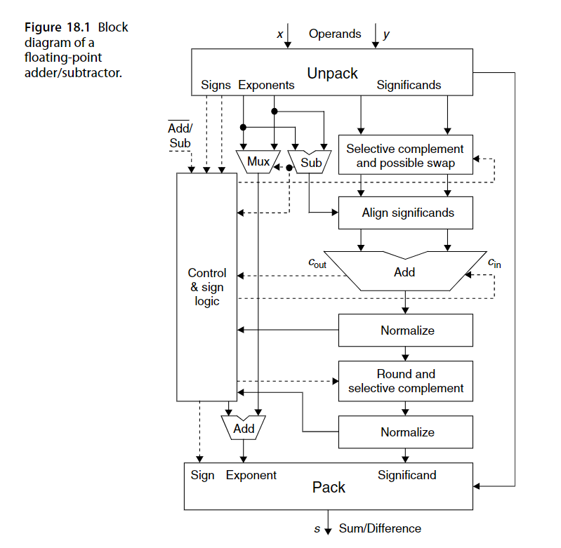

# FP的IEEE标准
## FP64
1 sign + 11 exp + 52 fra, bias = 1023.
## FP32
1 sign + 8 exp + 23 fra, bias = 127.
## 特殊表示
exp取0: 次规范数, 整数部分取0.
exp取最大, fra取0: INF.
exp取最大, fra不为0: NAN.
## 舍入方法
1. 向最近的有效数舍入.
2. 如果它与两个相邻的有效数距离一样时(中间数，halfway),那么舍入到最近的偶数有效数.
3. 如果以形式1.RR..RDD..D表示浮点数(R表示有效位,D表示舍去位),舍入规则如下:
   1. 如果DD..D < 10..0,则向下舍入.
   2. 如果DD..D > 10..0,则向上舍入.
   3. 如要DD..D = 10..0,则向最近偶数舍入,细则如下:
      1. 如果RR..R = XX..0,则向下舍入.
      2. 如果RR..R = XX..1,则向上舍入.
## 异常
1. 溢出: INF.
2. 下溢: 0.
3. 无效操作: NAN.
4. 除以零: 
   1. 正常浮点数除以0: INF.
   2. INF或0除以0: NAN.
# FP加减法
## 数据通路

## 模块
### Unpack
将两个操作数拆包,步骤如下:
1. 分离操作数的sign,exp,fra,并在拆包结果中处理隐藏的1.
2. 将操作数转为运算器的内部各式(如将FP32扩展为FP64).
3. 检测特殊的操作数和异常(如识别非数字输入NAN,若识别到则应绕过加法器).
### Selective complement and possible swap
### Align significands
### Normalize
### Round and selective complement
### Pack
### Control & sign logic